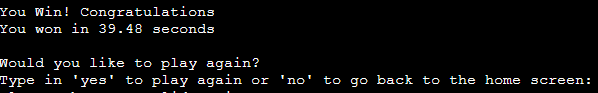
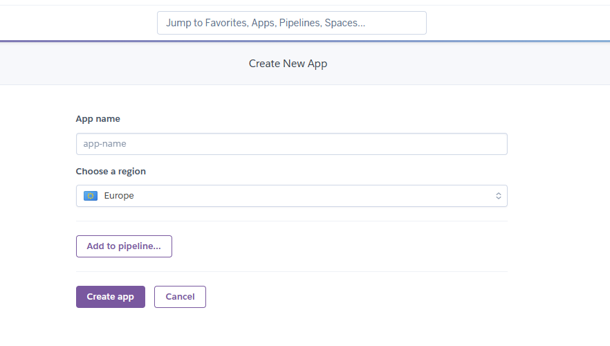

# Terminal Games
- Terminal games is a python project that has a dashboard where you can select to play a variety of games, the current game available is Battleships but the code is left open to add new games with ease.

## Battleships
- Battleships is a game where you guess co-ordinates on a map, the objective is to sink the enemy ships before your own are sunk.
    - In the version I have created, you play against the computer. 
    - Option 1 in the initial screen has the ships visible for testing purposes, I have left it in to showcase the different options in the main screen.
    - Option 2 has the original playable version of battleships with the computer ships hidden.

## Live Deployment
- Terminal games is deployed through Heroku the live deployment is here: [Terminal-Games](https://terminal-games-a4b70cb979e5.herokuapp.com/)
- The repository for this project is on GitHub and is located here: [Terminal-Games-Repository](https://github.com/LiamEdwards931/Terminal-games.git)

## Contents
- [Terminal-Games](#terminal-games)
    - [BattleShips](#battleships)
- [Live-Deployment](#live-deployment)
- [Inspiration](#inspiration)
- [User-Experience](#user-experience)
    - [Flow_Chart](#flow-chart)
    - [Features](#features)
        - [Start_Screen](#start-screen)
        - [Option_1](#option-1)
        - [Option_2](#option-2)
        - [Option_3](#option-3)
        - [Guess](#guess-input)
        - [Guess-Tracking](#guess-tracking)
        - [Winning](#win-screen)
        - [After_The_Win](#options-after-the-win)
    - [Future_features](#future-features)
- [Testing](#testing)
    - [Validation](#technology)
    - [Bugs](#bugs)
    - [Commits](#commits)
- [Technology_used](#technology-used)
- [Deployment](#deployment)
    - [Heroku](#heroku)
    - [Cloning](#cloning-a-repository)
- [credits](#credits)
- [Acknowledgements](#acknowledgments)

## Inspiration

- I wanted to create an app that is not linear and leaves a lot of room to grow, Battleships is just the start of the classic games that can be played. 
and it will be interesting to develop some more ideas in the future.

## User experience

- With the project terminal games, I am trying to envoke a positive user experience by giving them a simple landing page in which they can easily access the games they wish to play, by simply pressing the number for the game they want to play they can enjoy the game for example in battleships once this game is over, they can easily go back to the landing page to select another game if they wish too or from here they can simply exit the program.

- With the battleships game I wanted to create 2 boards so you could keep track of your own guesses but also to see where the computer was hitting too, to make the game feel a little bit more authentic.

    - As a user I would expect intuitive navigation of the app
    - As a user I would expect easy readability
    - As a user I would expect the game to run and be able to play without assistance
    - As a user I would expect the computer to offer a satisfying challenge
    - As a user I would expect to be able to play the game again if I wanted
    - As a user I would expect to be able to return to the main landing page
    - As a user I would expect to see the game board in a clear way.

## Flow Chart

Here is a flowchart mapping the programs within Terminal-Games

## Features

### Start screen

This is the starting screen that players will expect when starting terminal games:

### Option 0

If the user selects option 0 they see this:

### Option 1

If the user selects option 1. Battleships they come to this screen:

### Option 2 

If the user selections option 2. Battleships Main Game they come to the exact same battleships game as option 1 except the ships are hidden as intented to play

### Option 3

If the user selects Option 3 it opens up the leaderboard for the player to see the Time they have beaten the computer:

### Guess input

From here the user can play the battleships game by guessing a grid location this, the computer then takes it's turn:

### Guess Tracking

Player and Computer guesses are tracked visually on the board, the previous guess was A6 represented by O and hits by an X:
- Computers guess on player board

- Players guess on computer board

### Win screen

When you beat the computer, you get a congratulations and it also tells you how long it took you to win
it then asks if you would like to play again:

### Options after the win

- If player types 'yes' it resets the board with ships in new positions to play again
- If the player types 'no' it takes you back to the Terminal Games home page where you can select a game, Battleships again if you like.

Terminal games has input validation - you can only select the options that are available and empty inputs are not allowed.

[home](#terminal-games)

### Future Features
- With the way that I have set the landing page up for terminal games, the future features will be to implement more games that can be easily accessed through the options on the run file.

- Specifically for the battleships game, I will implement a more structured computer that checks it's previous guesses and tries to calculate new places to hit 

[home](#terminal-games)

## Testing

- I have tested the terminal games project by: 
    - Running the game and checking each input works as it should.
    - Checking different possibilities in the input field to check my validation is working correctly.
    - Ran and completed the battleship game to ensure that the home screen is working again
    - This also included checking you can re-enter the game after it had been reset. 
    - Took the code line by line to check for any whitespace, indentation issues.
    - Played the game where the computer wins to ensure that it is registering correctly. 
    - Tested the visuals and breaks in the lines to give readability.
    - Ran the project through PEP8 as stated below.
    - Repeated this process when game was deployed to Heroku.
    - Tested every square on the board to ensure that the output was responding to the gird location.
    - Repeated this test by winning and then choosing restart.
    - Repeated this by winning and then exiting and then re-entering the game
    - Tested the game by after wins exiting and choosing the other options to check functionality

For more in depth testing go here [Testing](testing.md)

[home](#terminal-games)

## Validation

- Went through [pep8](https://www.pythonchecker.com/) with no significant issues

### BUGS 
- Bug where if user types "no" to exit the game it repeatedly asks without breaking the loop. 
    - fixed by calling the import at the top and the function with the option with the correct syntax. "battleships.battleships()"

- Bug where if user entered empty field it would cause an error 
    - fixed this by wrapping the inputs and main game loop in a while loop looking for a correct validation

- Bug where when player went back to the terminal games page after beating battleships it would not let you re-enter the game. 
    - Same fix as the first example

- Game was crashing when restart game was called.
    - fixed by correctly indenting the call to restart the game

- Battleships was not running when user selected 1.
    - fixed by correctly adding the validation checks on the run file.

- Player was prompted to enter "no" twice when beating the game after the first game
    - fixed this by removing the restart game function and directly calling the game function again in the restart option, so game loop correctly breaks.

[home](#terminal-games)

### Commits 
- Several large commits whilst fixing issues, as I was deleting or rearranging a lot of code to try to get the code running the way that I needed it too.
I didn't commit the changes as I was doing it as the code wasn't behaving in the way that I was expecting it too and wished to commit only when it was working.

[home](#terminal-games)

## Technology used

- This app was created using python

[home](#terminal-games)

## Deployment

### Heroku

This project is deployed with Heroku - the steps to deploy are as follows:
- Sign in and click "Create new app"

- Name your project and select you region:

- Add your buildpack with python going in first and then Node.js second:

- Go to deploy and connect your repository for your project using the GitHub Option

- Once you have connected deploy from main branch - choose "automatic updates if you want to update as you work on your project" if not press deploy at the bottom

- Terminal games is deployed through Heroku the live deployment is here: [Terminal-Games](https://terminal-games-a4b70cb979e5.herokuapp.com/)

### Cloning a repository

1. On your GitHub repository navigate to your repository page.
2. Click on the green button with "CODE" written in it.
3. Go to the HTTPS and copy the URL by pressing the overlapping squares.
4. Open Git Bash.
5. Enter git clone followed by the copied URL.
6. Enter where you would like your repository to be saved too for your local file.
7. Press Enter to finalise the clone.

[home](#terminal-games)

## Credits

- The game board code was taken from an idea from: [here](https://copyassignment.com/battleship-game-code-in-python/)
- Had help with the computer turns and input validation [stack-overflow](https://stackoverflow.com/)
- [stack-overflow](https://stackoverflow.com/) was also used to help create the leaderboard.
- Used the love-sandwiches video for a refresher on how to deply the app to Heroku

## Acknowledgments

- This project was created for the level 3 diploma Full Stack Developer with the [Code Institute](https://codeinstitute.net/full-stack-software-development-diploma/?utm_term=code%20institute&utm_campaign=CI+-+UK+-+Search+-+Brand&utm_source=adwords&utm_medium=ppc&hsa_acc=8983321581&hsa_cam=1578649861&hsa_grp=62188641240&hsa_ad=635720257674&hsa_src=g&hsa_tgt=kwd-319867646331&hsa_kw=code%20institute&hsa_mt=e&hsa_net=adwords&hsa_ver=3&gad=1&gclid=CjwKCAjw67ajBhAVEiwA2g_jEKYbx7CDH4ExZGh3udf-5qh-Ee91R2MXr7F5M4UdbdDhV-c-QZ-_zxoCyW4QAvD_BwE)
- [Precious Ijege](https://www.linkedin.com/in/precious-ijege-908a00168/) for the constructive feedback with my milestone project.

Liam Edwards 2023.

[home](#terminal-games)

